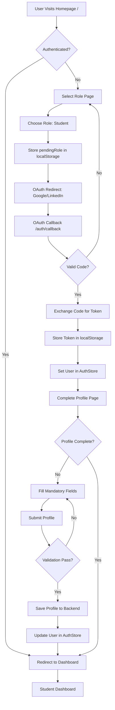
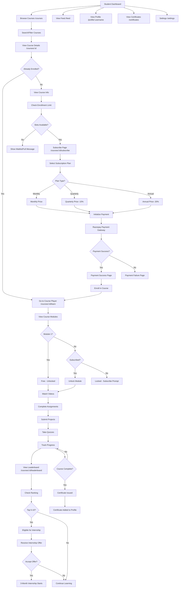
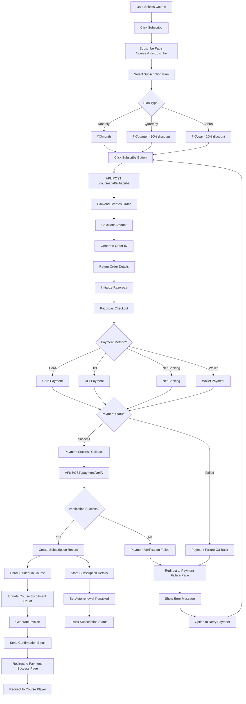
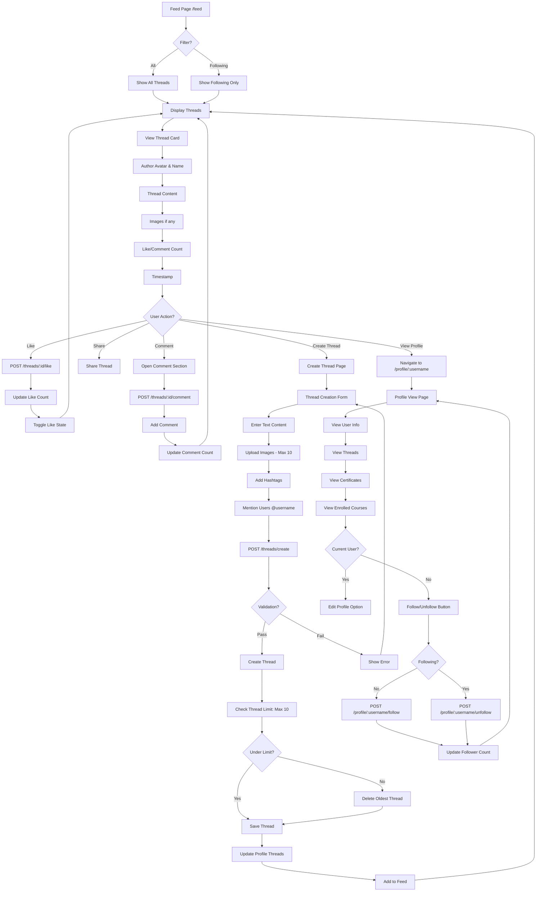
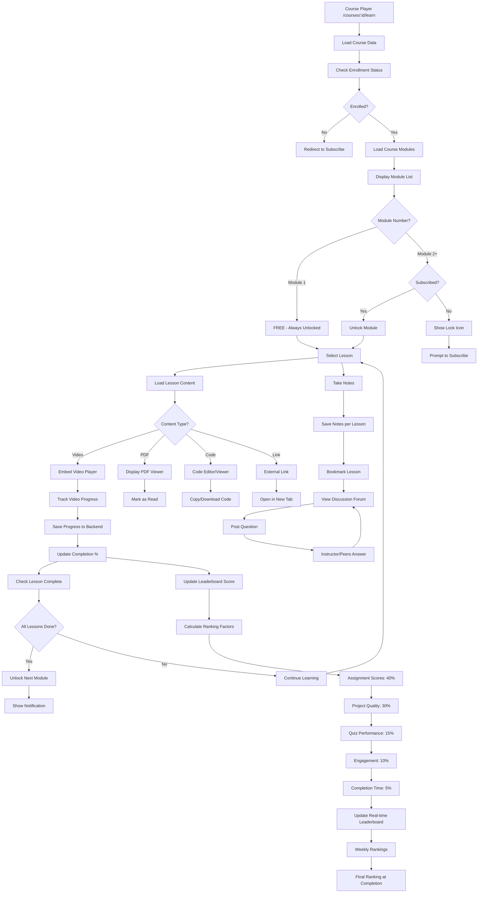
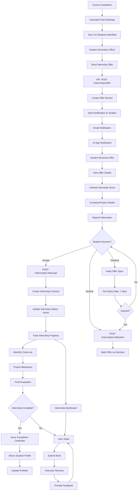
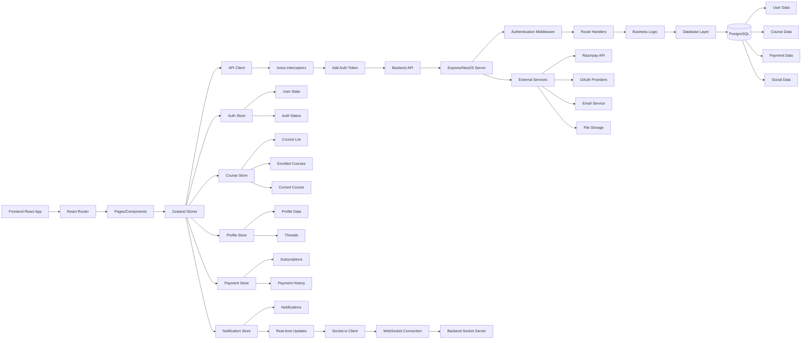
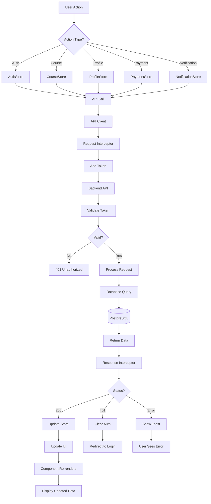

# Mentorise - Complete Flow Diagram

## Overview
This document provides a comprehensive flow diagram of the Mentorise platform, showing all user journeys, system interactions, and data flows.

---

## 1. Application Entry & Authentication Flow



---

## 2. Student Journey Flow



---

## 3. Payment & Subscription Flow



---

## 4. Social Features Flow



---

## 5. Course Learning Flow



---

## 6. Internship Selection Flow



---

## 7. Certificate Generation Flow

```mermaid
flowchart TD
    A[Student Completes Course] --> B[All Modules Completed]
    B --> C[All Assignments Submitted]
    C --> D[All Quizzes Passed]
    D --> E[Projects Reviewed]
    E --> F[Minimum Score Achieved]
    
    F --> G[Course Completion Triggered]
    G --> H[System Validates Completion]
    
    H --> I{Meets Requirements?}
    I -->|Yes| J[Auto-Issue Certificate]
    I -->|No| K[Request Additional Work]
    K --> C
    
    J --> L[API: POST /certificates/issue]
    L --> M[Generate Certificate Data]
    M --> N[Create Unique Certificate ID]
    N --> O[Include Course Details]
    O --> P[Include Student Details]
    P --> Q[Include Instructor Details]
    Q --> R[Include Completion Date]
    R --> S[Generate Certificate PDF]
    
    S --> T[Store Certificate in Database]
    T --> U[Add to Student Profile]
    U --> V[Update Certificates Page]
    V --> W[Send Email Notification]
    W --> X[Certificate Download Link]
    
    X --> Y[Student Views Certificate]
    Y --> Z[/certificates Page]
    Z --> AA[Display Certificate Card]
    AA --> AB[Certificate ID]
    AB --> AC[Course Name]
    AC --> AD[Instructor Name]
    AD --> AE[Issue Date]
    AE --> AF[Download PDF Button]
    AF --> AG[Shareable Link]
    
    AG --> AH[Verification System]
    AH --> AI[Unique Certificate ID]
    AI --> AJ[Blockchain Verification - Future]
    AJ --> AK[Public Verification Page]
```

---

## 8. System Architecture Flow



---

## 9. Data Flow Diagram



---

## 10. Navigation Flow Map

```mermaid
flowchart TD
    A[Homepage /] --> B[Auth Flow]
    A --> C[Browse Courses /courses]
    A --> D[View Feed /feed]
    
    B --> E[/auth/select-role]
    E --> F[/auth/callback]
    F --> G[/auth/complete-profile]
    G --> I[/dashboard/student]
    
    I --> K[My Courses]
    I --> L[Progress Tracking]
    I --> M[Certificates]
    I --> N[Leaderboard]
    
    C --> S[/courses/:id]
    S --> T[/courses/:id/subscribe]
    T --> U[/payment/success]
    T --> V[/payment/failure]
    U --> W[/courses/:id/learn]
    V --> T
    
    W --> X[/courses/:id/leaderboard]
    
    D --> Y[/threads/create]
    D --> Z[/profile/:username]
    
    Z --> AA[/profile/edit]
    
    I --> AB[/certificates]
    I --> AC[/internships]
    I --> AD[/settings]
```

---

## Key Features Summary

### Authentication & Authorization
- Role-based access (Student/Mentor)
- OAuth integration (Google/LinkedIn)
- JWT token management
- Session persistence

### Course Management
- Course browsing & search
- Enrollment with limits (30-50 students)
- Progressive module unlocking
- Video/content delivery

### Payment & Subscriptions
- Multiple subscription tiers (Monthly/Quarterly/Annual)
- Razorpay integration
- Payment verification
- Auto-renewal support

### Learning Features
- Progress tracking
- Assignment submission
- Quiz system
- Project reviews
- Notes & bookmarks
- Discussion forums

### Ranking & Internships
- Real-time leaderboard
- Multi-factor ranking algorithm
- Top performer selection
- Internship offer system
- 3-month internship tracking

### Social Features
- Threads (posts with images)
- Like/Comment system
- Follow/Unfollow
- Personalized feed
- Profile viewing

### Certifications
- Course completion certificates
- PDF generation
- Verification system
- Profile integration

---

## Technology Stack

**Frontend:**
- React 18 + TypeScript
- React Router v6
- Zustand (State Management)
- TanStack Query
- Axios (API Client)
- shadcn/ui + Tailwind CSS
- Socket.io Client

**Backend (Expected):**
- Node.js + Express/NestJS
- PostgreSQL
- Redis (Caching)
- JWT Authentication
- Razorpay SDK
- Socket.io Server

**External Services:**
- Razorpay (Payments)
- Google OAuth
- LinkedIn OAuth
- Email Service (SendGrid/AWS SES)
- File Storage (AWS S3/Cloudinary)

---

*Last Updated: 2024*
*Document Version: 1.0*

