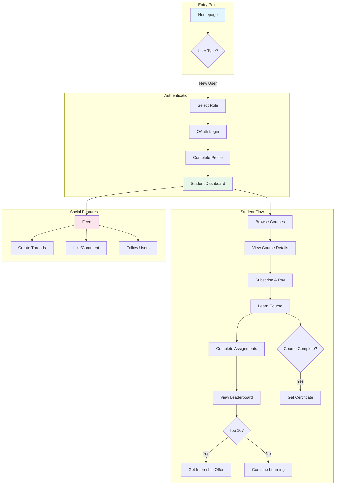

# Mentorise - Flow Summary

## Quick Reference Flow Diagram



## Main User Journeys

### 1. Student Journey
```
Homepage → Select Role (Student) → OAuth → Complete Profile → 
Dashboard → Browse Courses → Subscribe → Learn → Complete → 
Certificate → (Top 10) → Internship Offer
```

### 2. Payment Flow
```
Course Selection → Subscribe Page → Choose Plan → 
Razorpay Payment → Success/Failure → Course Access
```

### 3. Learning Flow
```
Enrolled Course → Course Player → Module 1 (Free) → 
Module 2+ (Unlocked) → Watch Videos → Complete Assignments → 
Submit Projects → Take Quizzes → Track Progress → Leaderboard
```

## Key Routes

| Route | Purpose | Access |
|-------|---------|--------|
| `/` | Homepage | Public |
| `/auth/select-role` | Role Selection | Public |
| `/auth/callback` | OAuth Callback | Public |
| `/auth/complete-profile` | Profile Setup | Authenticated |
| `/dashboard/student` | Student Dashboard | Student |
| `/courses` | Course Listing | Public |
| `/courses/:id` | Course Details | Public |
| `/courses/:id/subscribe` | Subscription | Authenticated |
| `/courses/:id/learn` | Course Player | Enrolled Students |
| `/courses/:id/leaderboard` | Rankings | Enrolled Students |
| `/feed` | Social Feed | Authenticated |
| `/threads/create` | Create Post | Authenticated |
| `/profile/:username` | View Profile | Public |
| `/profile/edit` | Edit Profile | Owner |
| `/certificates` | My Certificates | Authenticated |
| `/internships` | Internship Info | Authenticated |
| `/payment/success` | Payment Success | Authenticated |
| `/payment/failure` | Payment Failure | Authenticated |
| `/settings` | Settings | Authenticated |

## State Management Stores

1. **AuthStore** - User authentication & role
2. **CourseStore** - Courses, enrollments, progress
3. **ProfileStore** - User profiles, threads
4. **PaymentStore** - Subscriptions, payment history
5. **NotificationStore** - Real-time notifications

## API Endpoints (Expected)

### Authentication
- `POST /auth/callback` - OAuth callback
- `POST /auth/logout` - Logout

### Courses
- `GET /courses` - List courses
- `GET /courses/:id` - Course details
- `POST /courses/:id/subscribe` - Subscribe
- `GET /courses/:id/learn` - Course content
- `GET /courses/:id/leaderboard` - Rankings

### Profile
- `GET /profile/:username` - Get profile
- `PUT /profile/edit` - Update profile
- `POST /profile/:username/follow` - Follow user

### Social
- `GET /feed` - Get feed
- `POST /threads/create` - Create thread
- `POST /threads/:id/like` - Like thread
- `POST /threads/:id/comment` - Comment

### Payment
- `POST /payment/verify` - Verify payment
- `GET /payment/history` - Payment history

### Certificates
- `GET /certificates` - List certificates
- `POST /certificates/issue` - Issue certificate

### Internships
- `GET /internships` - List internships
- `POST /internships/offer` - Offer internship
- `POST /internships/:id/accept` - Accept offer (Student)

